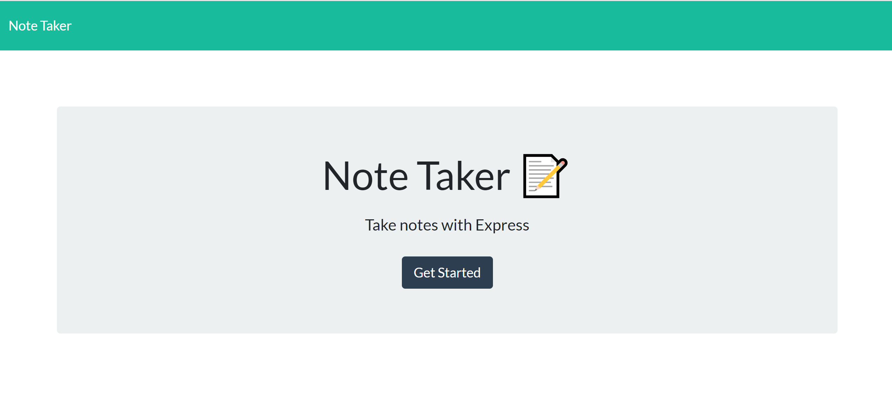

# Note Taker

# Description
This application can be used to write, save, and delete notes. This application will use an express backend and save and retrieve note data from a JSON file. 

## User Story

AS A user, I want to be able to write and save notes
I WANT to be able to delete notes I've written before
SO THAT I can organize my thoughts and keep track of tasks I need to complete

## Business Context

For users that need to keep track of a lot of information, it's easy to forget or be unable to recall something important. Being able to take persistent notes allows users to have written information available when needed.

## Acceptance Criteria

Application should allow users to create and save notes. (pass)
Application should allow users to view previously saved notes. (pass)
Application should allow users to delete previously saved notes. (pass)

# Application Functionalities illustration video

[Video Link](https://drive.google.com/file/d/1Co4o8BDzaeCWjAW6s2AavhELsvhlAQB7/view)

# Application Generated HTML Page Sample

# Heruko Deployed Application URL

# Installation
1- Ensure initilazing the application with nmp i, to include all dependent modules included in the package.json file.

# Test

The functionality built base into to static routes:

  * GET `/notes` - Should return the `notes.html` file.
  * GET `/` - Should return the `index.html` file

The application has a `db.json` file on the backend that will be used to store and retrieve notes.

The following API routes should be created:
  * GET `/api/notes` - Should read the `db.json` file and return all saved notes as JSON.
  * POST `/api/notes` - Should receive a new note to save on the request body, add it to the `db.json` file, and then return the new note to the client.
  * DELETE `/api/notes/:id` - Should receive a query parameter containing the id of a note to delete. This means you'll need to find a way to give each note a unique `id` when it's saved. In order to delete a note, you'll need to read all notes from the `db.json` file, remove the note with the given `id` property, and then rewrite the notes to the `db.json` file.

# Repository

- [Project Repo](https://github.com/JordanNaei/noteTaker)

